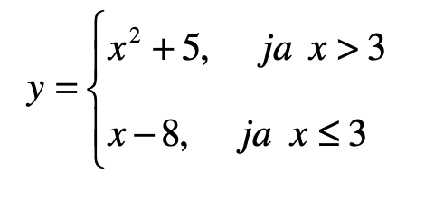
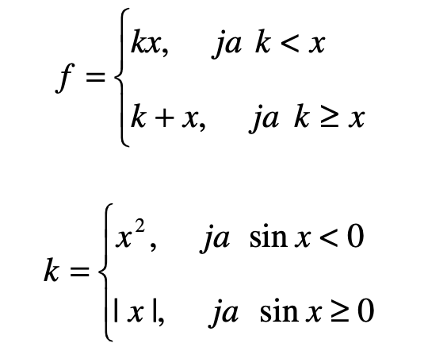

# Uzdevumi patstāvīgai risināšanai tematā "Sazarošanās operatori"

1. Tiek ievadīts vesels skaitlis. Pārbaudīt vai šis skaitlis ir pāra skaitlis.
2. Tiek ievadīts vesels skaitlis. Pārbaudīt vai šis skaitlis ir nepāra skaitlis.
3. Tiek ievadīts vesels skaitlis. Pārbaudīt vai šis skaitlis dalās bez atlikuma ar 3.
4. Tiek ievadīti divi veseli skaitļi. Pārbaudīt vai pirmais dalās bez atlikuma ar otro.
5. Tiek ievadīts vesels skaitlis. Pārbaudīt vai šis skaitlis ir pāra skaitlis un dalās bez atlikuma ar 3.
6. Tiek ievadīti divi veseli skaitļi. Pārbaudīt vai pirmais skaitlis ir nepāra skaitlis un dalās bez
   atlikuma ar otro skaitli.
7. Tiek ievadīti divi veseli skaitļi. Pārbaudīt vai vismaz viens no tiem ir nepāra skaitlis.
8. Tiek ievadīti divi veseli skaitļi. Pārbaudīt vai tie abi divi ir pāra skaitļi.
9. Tiek ievadīti divi veseli skaitļi. Pārbaudīt vai pirmais ir pāra skaitlis, bet otrais – nepāra skaitlis.
10. Tiek ievadīts vesels skaitlis. Pārbaudīt vai šis skaitlis ir pozitīvs vai 0.
11. Tiek ievadīts vesels skaitlis. Pārbaudīt vai šis skaitlis ir vienzīmes skaitlis (sastāv no viena
    cipara).
12. Tiek ievadīts vesels skaitlis. Pārbaudīt vai šis skaitlis ir vienzīmes skaitlis (sastāv no viena
    cipara) un ir pozitīvs.
13. Tiek ievadīts vesels skaitlis. Pārbaudīt vai šis skaitlis ir divzīmju skaitlis.
14. Tiek ievadīts vesels skaitlis. Pārbaudīt vai šis skaitlis ir divzīmju skaitlis un ir negatīvs.
15. Tiek ievadīts vesels skaitlis. Pārbaudīt vai šis skaitlis ir trīszīmju skaitlis un dalās bez atlikuma ar 5.
16. Tiek ievadīts vesels skaitlis. Pārbaudīt vai šis skaitlis ir pozitīvs vai negatīvs, bet nav 0.
17. Tiek ievadīts vesels dīvzīmju skaitlis. Vai šajā skaitlī visi cipari ir vienādi?
18. Tiek ievadīts vesels dīvzīmju skaitlis. Vai šajā skaitlī visi cipari ir atšķirīgi?
19. Tiek ievadīts vesels trīszīmju skaitlis. Vai šajā skaitlī visi cipari ir atšķirīgi, bet nav ciparu, kuri ir
    0?
20. Tiek ievadīts vesels trīszīmju skaitlis. Vai ša skaitļa ciparos ir vismaz viens vieninieks?
21. Tiek ievadīts vesels trīszīmju skaitlis. Vai šajā skaitlī visi cipari atrodas augošā secībā virzienā no
    kreisās uz labo pusi?
22. Tiek ievadīts vesels trīszīmju skaitlis. Vai šajā skaitlī visi cipari atrodas augošā secībā virzienā no
    labas uz kreiso pusi?
23. Tiek ievadīti trīs veseli skaitļi. Aprēķināt tikai to skaitļu summu, kuri ir pozitīvi.
24. Tiek ievadīti trīs veseli skaitļi. Aprēķināt tikai to skaitļu summu, kuri ir negatīvi var vienādi ar 1.
25. Tiek ievadīti četri veseli skaitļi. Aprēķināt tikai to skaitļu reizinājumu, kuri dalās bez atlikuma ar
    citu (piekto) ievadīto skaitli.
26. Tiek ievadīti četri veseli skaitļi. Aprēķināt tikai to skaitļu daudzumu, kuriem pēdējais cipars ir 9. 
27. Tiek ievadīti koeficienti (veseli skaitļi) a, b un c. Atrast vienādojuma ax^2 + bx + c = 0 saknes vai
  paziņot ka risinājuma nav.
28. Tiek ievadīta punkta M koordinātas x un y. Pārbaudīt pie kādas koordinātu plaknes kvadranta
    pieder punkts M(x,y), ja x un y – veseli skaitļi, kuri nav vienādi ar 0.
29. Tiek ievadīta vērtība х (vesels skaitlis). Aprēķināt vērtību y, ja:

30. Tiek ievadīta vērtība х (vesels skaitlis). Aprēķināt funckijas f(x) vērtību, ja:

31. Tiek ievadītas divas paralelograma blakus malas a и b (veseli skaitļi), kā arī leņķis starp tām
    (grādos). Noteikt paralelograma veidu: rombs, taisnstūris, kvadrāts vai parastais
    paralelograms.
32. Tiek ievadīti divi leņķi (grādos), kas pieguļ vienai no divām četrstūra paralēlām malām. Noteikt
    tā veidu: parastā trapece, taisnlenķa trapece, vienādsānu trapece, taisnstūris vai
    paralelograms.
33. Tiek ievadīti četri veseli a, b, c un d. Ir zināms, ka trīs no tiem ir vienādi, bet viens ir atšķirīgs.
Izvadīt šo skaitli uz ekrāna. Piemēram, ja a = 3, b = 5, c = 3, d = 3, tad uz ekrāna jāizvada skaitlis 5.
34. Tiek ievadīti divi ātrumi – viena km/st, bet cits m/s. Kāds no ātrumiem ir lielāks?
35. Futbola čempionātā komandai par uzvaru tiek doti 3 punkti, par zaudējumu – 0, par neizšķirtu
rezultātu – 1. Tiek ievadīts punktu skaits, kuru ieguva komanda par spēli. Noteikt vārdisko
spēles rezultātu (uzvara, zaudējums, neizšķirts).
36. Tiek ievadīts amatieru boksera svars. Bokseru svaru kategorijas var būs šādas:
a) vieglais svars – līdz 60 kg;
b) pirmais pusvidējais svars – līdz 64 kg;
c) pusvidējais svars – līdz 69 kg.
Noteikt boksera svara kategoriju.
37. Spēļu kāršu mastiem nosacīti ir piešķirti sekojošie kārtas numuri: „pīķis” – 1, „krusti” – 2,
„kāravi” – 3, „erceni” – 4. Pēc ievadīta masta numura noteikt tā nosaukumu.
38. Spēļu kāršu mastiem nosacīti ir piešķirti sekojošie kārtas numuri: „pīķis” – 1, „krusti” – 2,
„kāravi” – 3, „erceni” – 4, bet karšu vienību vērtībām piešķirti sekojošie kārtas numuri: „kalps”
– 11, „dāma” – 12, „kungs” – 13, „dūzis” – 14 (kārtas numuri pārejiem kārtiem atbilst to
nosaukumiem: „sešinieks”, „septiņnieks” utt.). Pēc ievadīta masta numura un vērtības numura
noteikt kārtes pilnu nosaukumu (masts un vērtība) veidā «Pīķa dāma», «Kārava sešinieks» utt.
39. Tiek ievadīta pirkuma summa. Ja summa ir lielāka vai vienāda ar 200 Eur, tad tiek piešķirta
atlaide 10% apmērā. Aprēķināt summu apmaksai.
40. Tiek ievadīta pirkuma summa. Ja summa ir lielāka vai vienāda ar 200 Eur, tad tiek piešķirta
atlaide 10% apmērā. Ja summa ir lielāka vai vienāda ar 500 Eur, tad tiek piešķirta atlaide 20%
apmērā. Aprēķināt summu apmaksai.
41. Tiek ievadīts cilvēka dzimšanas gads un mēneša numurs, kā arī šodienas gads un mēneša
numurs (janvāris – 1, februāris – 2 utt.). Noteikt cilvēka vecumu (pilnu gadu skaitu). Norādīto
mēnešu numuru sakrišanas gadījumā uzskatīt, ka pagājis pilns gads.
42. Tiek ievadīti divu cilvēku dzimšanas gads un mēneša numurs. Noteikt kurš no viņiem ir vecāks.
43. Luksofora darbs ir ieprogrammēts tā, ka katras stundas sākumā trīs minūšu laikā deg zaļā
gaisma, pēc tam divu minūšu laikā – sarkanā, tad trīs minūšu laikā – atkal zaļā utt. Tiek
ievadīts skaitlis t, kas apzīme laiku minūtēs, kurš pagājis kopš kārtējas stundas sākuma.
Noteikt kādas krāsas gaisma deg dotajā brīdī.
44. Tiek ievadīts auto degvielas tips (1 – „benzīns 95”, 2 – „benzīns 98», 3 – „dīzeļdegviela” utt.)
    un litru skaits. Aprēķināt auto uzpildes izmaksas. Cenām par 1 litru katram degvielas tipam
    jābūt zināmām un uzdotam programmā (cenas var izdomāt pašiem).
45. Tuvākā mājai maiznīca strādā no 7:00 līdz 19:00 un ir slēgta uz pārtraukumu no 13:00 līdz
15:00. Maizes veikals, kas atrodas tālāk, strādā no 8:00 līdz 20:00 un ir slēgts uz pārtraukumu
no 14:00 līdz 16:00. No 8:00 līdz 24:00 maizi var nopirkt gastronomijas veikalā, kas atrodas
tālāk nekā maizes veikals un strādā bez pusdienas pārtraukuma. Pēc laika lietotāja pulkstenis
noteikt kas ir labāk:
a) aiziet maiznīcā;
b) aiziet līdz maizes veikalam;
c) aizbraukt gastronomijas veikalā;
d) sēdēt mājās, jo viss ir slēgts.
Laiks tiek ievadīts sekojoši: stundas – skaitļa vesela daļa, minūtes – skaitļa daļveida daļa.
Piemēram, skaitlis 15.20 nozīmē 15 stundas 20 minūtes.